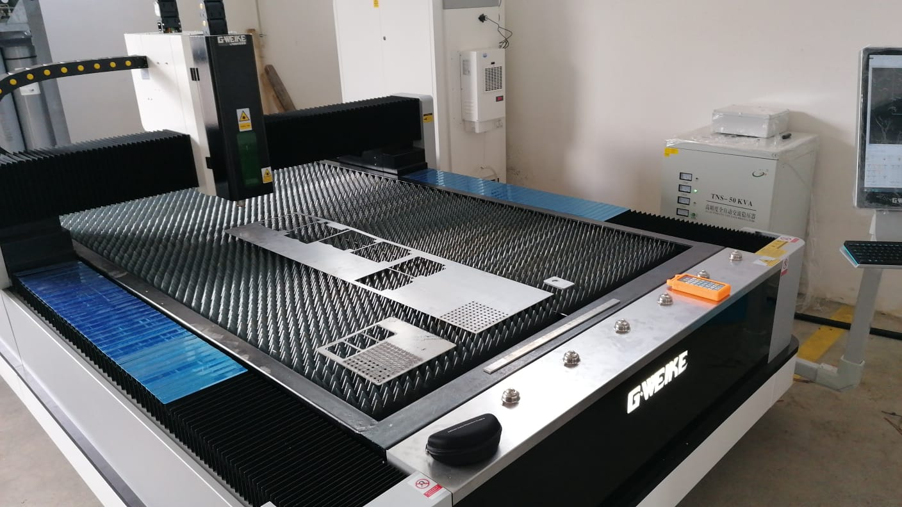
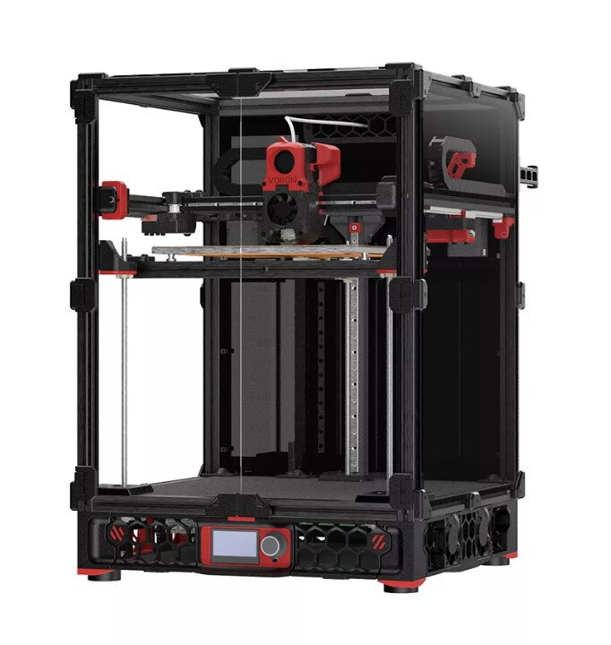
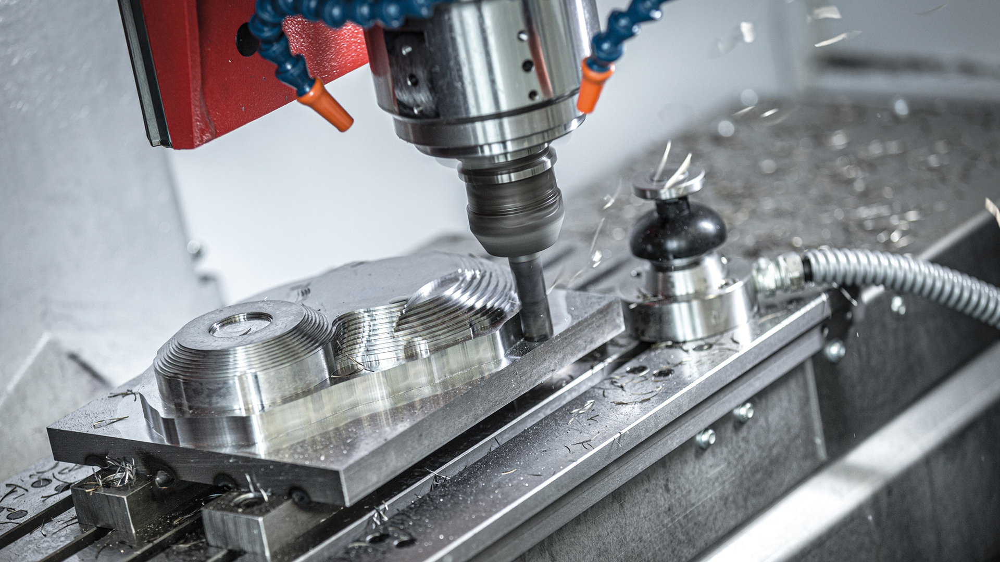

# Projekt – Jak vyrobit (téměř) cokoliv

Tento web slouží jako rozcestník k jednotlivým projektům, které vznikly v rámci kurzu „Jak vyrobit (téměř) cokoliv“. Najdete zde ukázky mých výtvorů, poznámky z procesu tvorby i finální výsledky.

  <a href="o-mne.html">O mně</a> | <a href="portfolio.html">Mé portfolio</a>

---

## 📂 Projekty

<!---  -->

<table>
  <tr>
    <td></td>
    <td></td>
  </tr>
  <tr>
    <td></td>
    <td></td>
  </tr>
  <tr>
    <td></td>
    <td></td>
  </tr>
  <tr>
    <td></td>
    <td></td>
  </tr>
  <tr>
    <td></td>
    <td></td>
  </tr>
</table>
