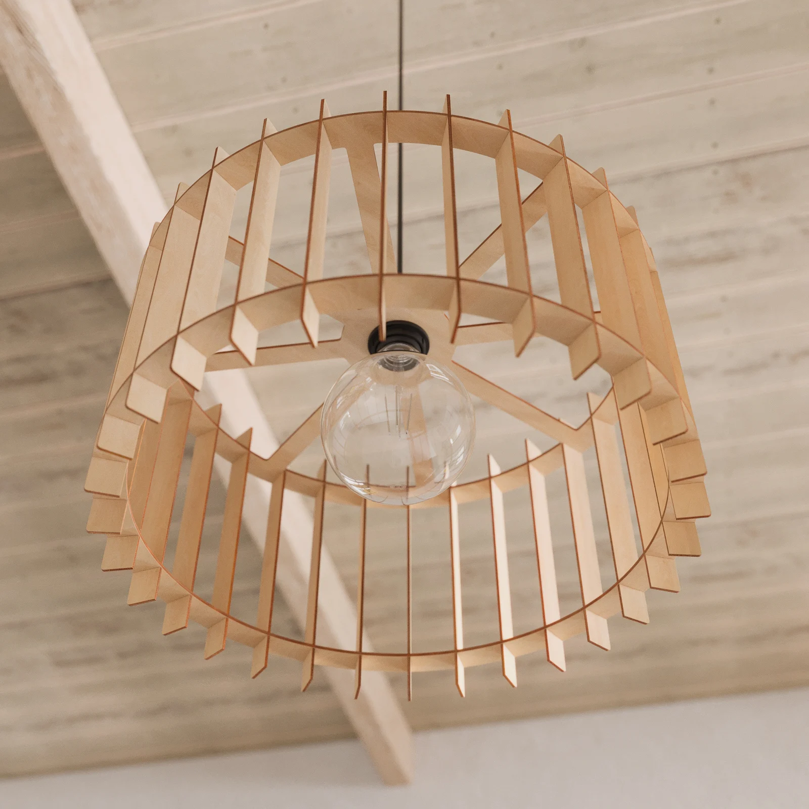
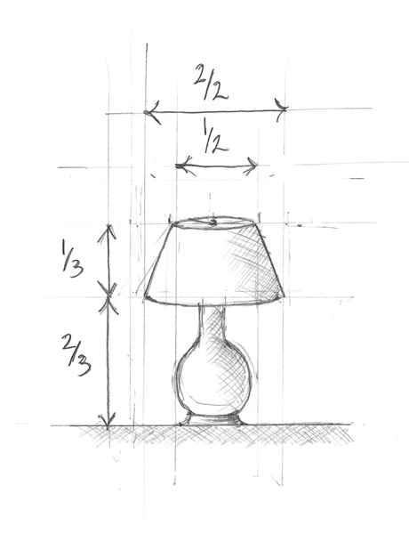
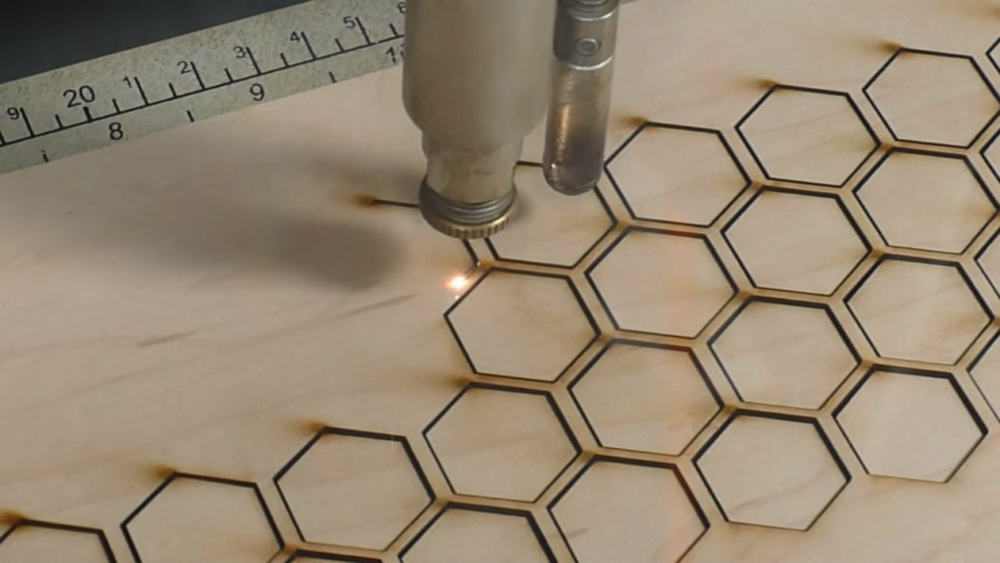
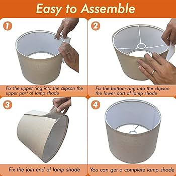
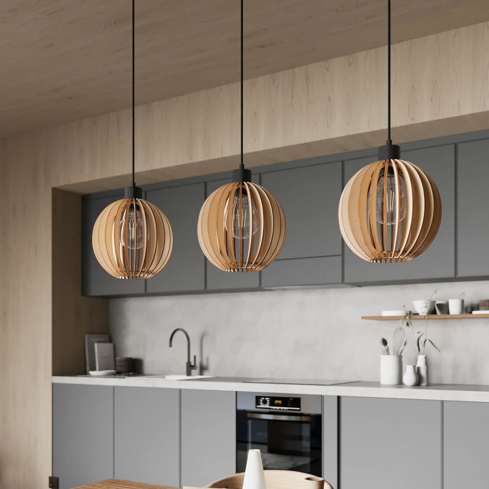

## Úvod

V rámci kurzu *Jak vyrobit (téměř) cokoliv* jsem se rozhodl navrhnout a vyrobit **stínítko na lampu** z **překližky**, které bude sestavené z několika segmentů vyřezaných **laserovou řezačkou**. Cílem bylo nejen vytvořit funkční a estetický objekt, ale také si osvojit základy práce s laserem a navrhování spojů bez nutnosti lepení.

---

## Návrh

### Inspirace
Inspirací mi byly organické tvary a jednoduché geometrické vzory, které se dají snadno dělit na jednotlivé segmenty a následně složit do prostorového objektu.

### Konstrukce
Stínítko jsem navrhl jako **modulární konstrukci** tvořenou opakujícími se pláty (segmenty), které se spojují do kruhové formy okolo středové osy. Každý segment má vybrání a zámečky tak, aby do sebe zapadly bez nutnosti lepidla.

Navrhoval jsem v programu **Fusion 360** (lze i Inkscape nebo Illustrator pro 2D), kde jsem si připravil 2D výkresy pro laser.

---

## Příprava výroby

### Materiál
Použil jsem **3mm březovou překližku**, která je dostatečně pevná, ale zároveň dobře řezatelná laserem.

### Parametry řezání
Laser: [uveď typ nebo model laseru, pokud chceš]  
Nastavení pro řez:  
- Výkon: 100 %  
- Rychlost: 6 mm/s  
- Frekvence: 500 Hz

> ⚠️ Tip: Vždy si před řezem ověř, že máš správně nastavené měřítko a otestuj jeden segment na zbytkový materiál.

---

## Sestavení

Po vyřezání všech dílů jsem jednotlivé segmenty vyčistil a sestavil podle plánu. Díky přesným spojům drží tvar i bez lepidla. Pokud by bylo potřeba větší pevnosti, lze spojky lehce přetřít lepidlem nebo použít gumičky k dočasnému stažení při lepení.

Středová osa byla tvořena dřevěnou tyčkou, na kterou se navlékají jednotlivé segmenty.

---

## Výsledek

Výsledné stínítko má příjemný organický tvar a hezky rozptyluje světlo díky mezerám mezi jednotlivými segmenty. Skvěle se hodí jako doplněk do interiéru nebo jako dárek.

---

## Co jsem se naučil

- Práce s vektorovou grafikou pro laserové řezání
- Přesnost návrhu spojů v rámci tolerance materiálu
- Optimalizace rozvržení segmentů na materiál
- Základy parametrického návrhu

---

## Ke stažení

- [Zdrojový soubor ve formátu SVG](files/stinitko-lampa.svg)
- [Fusion 360 návrh (F3D)](files/stinitko-lampa.f3d)
- [PDF pro laser](files/stinitko-lampa.pdf)

---

## Galerie

| Fáze návrhu | Řezání | Sestavování | Výsledek |
|-------------|--------|-------------|----------|
|  |  |  |  |

---

Pokud by tě zajímalo víc o práci s laserem nebo návrhu vlastního stínítka, neváhej mě kontaktovat nebo si projdi další mé projekty [zde](../).
